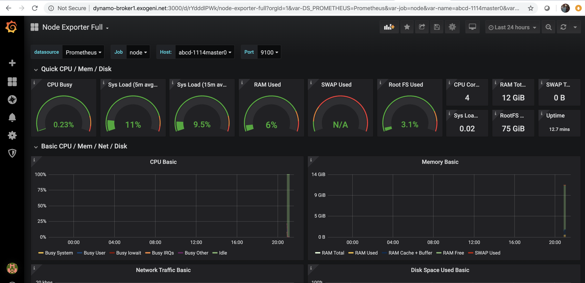
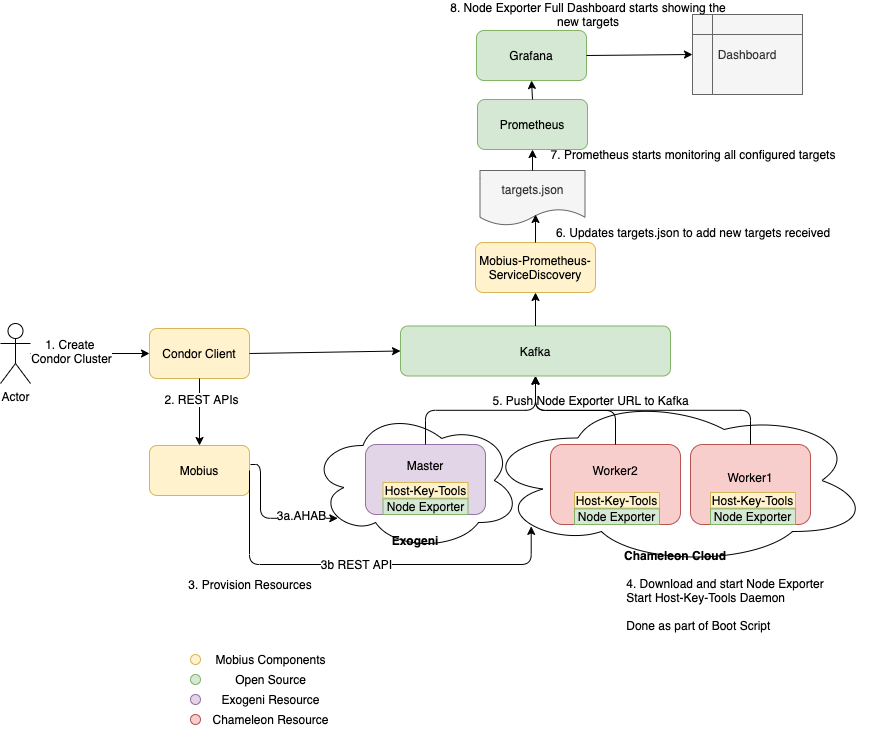

# Mobius-prometheus-service-discovery
Mobius Prometheus Service Discovery is used as described below to enable Prometheus and Grafana for Metric collection and Dashboard for each resource created via Mobius.
## Dasboard

## Component Diagram


## Usage
```
# /usr/bin/monitord --help
Usage: monitord start|stop|restart options

Options:
  -h, --help            show this help message and exit
  -k KAFKAHOST, --kafkahost=KAFKAHOST
                        kafkahost
  -t KAFKATOPIC, --kafkatopic=KAFKATOPIC
                        kafkatopic
```

To run it on CentOs 7, do the following:
```
git clone https://github.com/RENCI-NRIG/Mobius-prometheus-service-discovery
cd Mobius-prometheus-service-discovery/monitor-py/
python setup.py install
cp Mobius-prometheus-service-discovery/mobius-monitoring.service /usr/lib/systemd/system
```
Update /usr/lib/systemd/system/mobius-monitoring.service to specify the kafkahost and topic details. Run the below commands to start the service.
```
systemctl daemon-reload
systemctl enable mobius-monitoring.service
systemctl start mobius-monitoring.service
```

## Requirements
Kafka-Python
Python 2.7+

## Description
This software runs as a python Daemon and listens for new prometheus targets on Kafka.
- Adds any new targets added to Prometheus targets.json
- Deletes any removed targets from Prometheus targets.json
